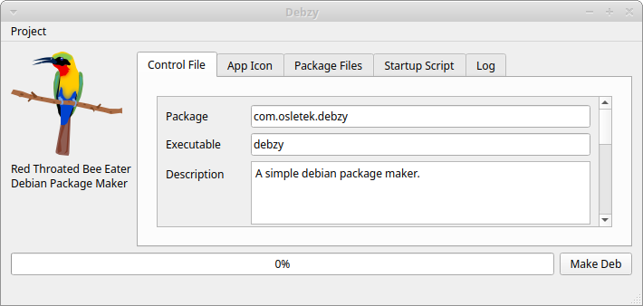

Making an Ubuntu Debian package is easy, right? Wrong! It is terribly hard and confusing.

  

I was trying to make a deb file for my products that users could download and install. That is when I said, \"You have got to be kidding me!\" I searched for tools that would make it easy to create my deb file, but these tools were not easy to use and had bugs. They were almost as frustrating as the command line tools. And that is when I decided to make my own.

  

Debzy is my attempt to simplify the deb making process. Try it and see for yourself.

Debzy is free for personal use. For commercial use, please purchase a license.
